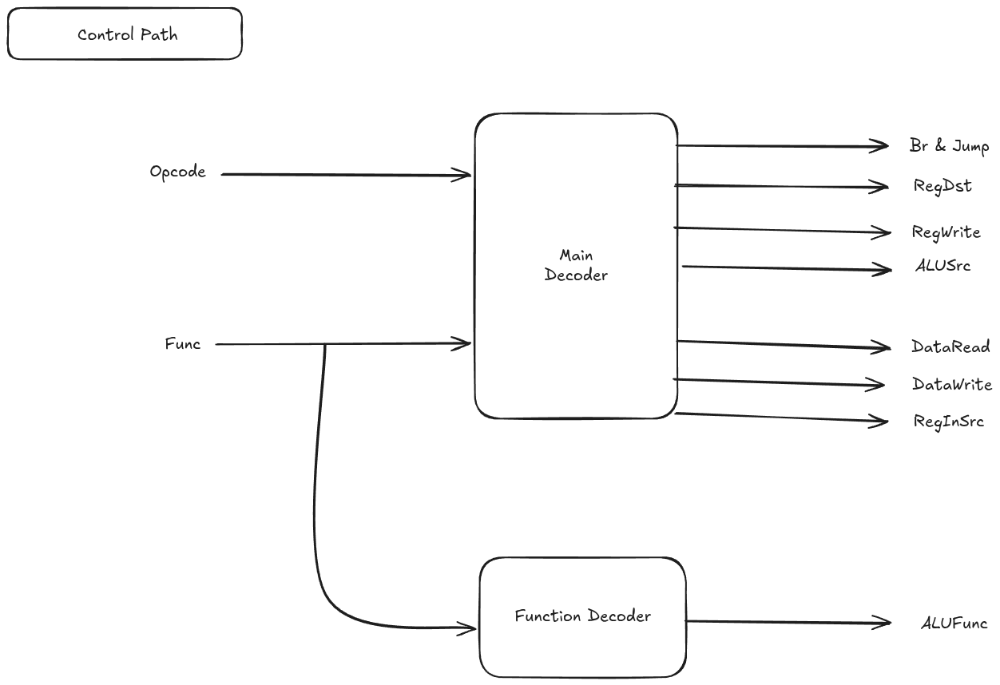
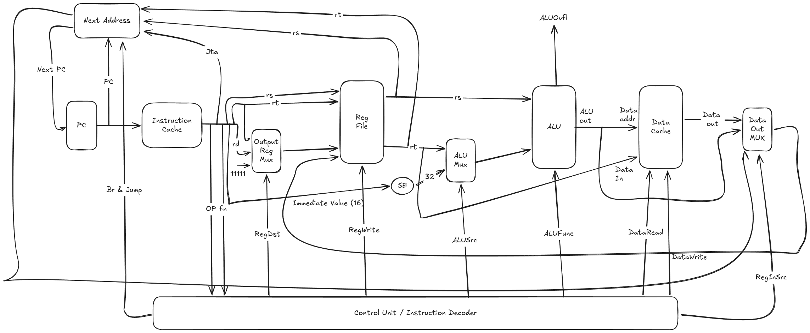
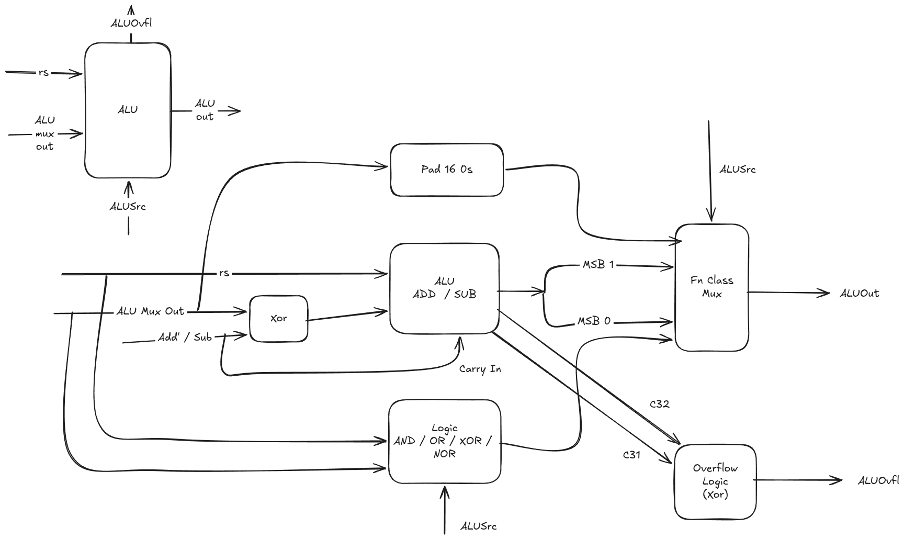
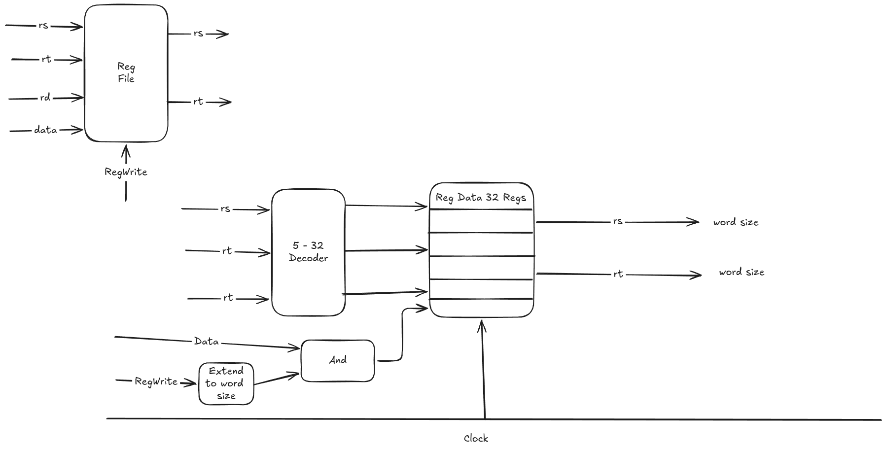
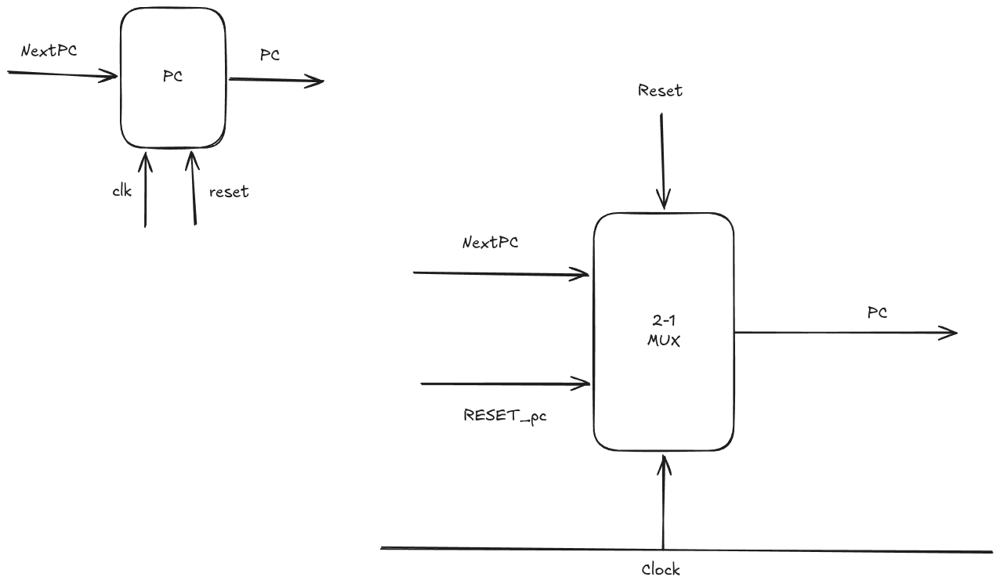
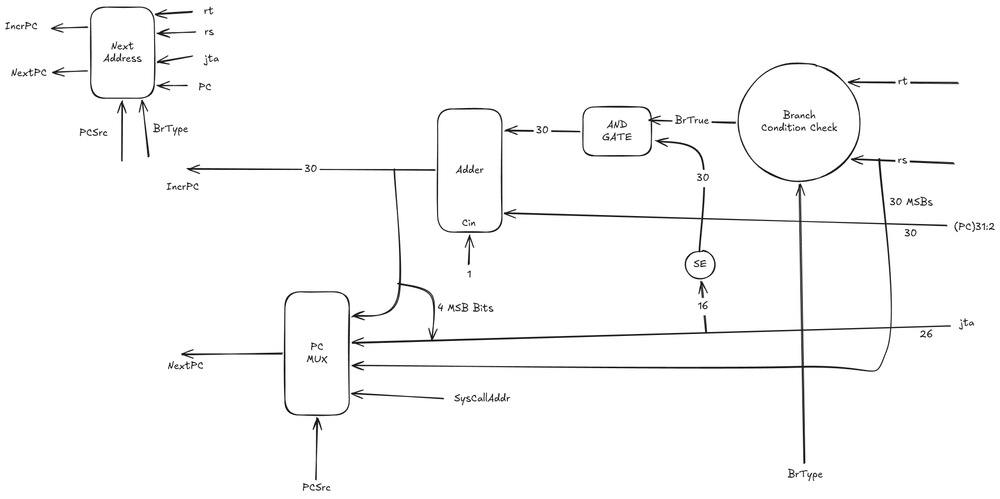
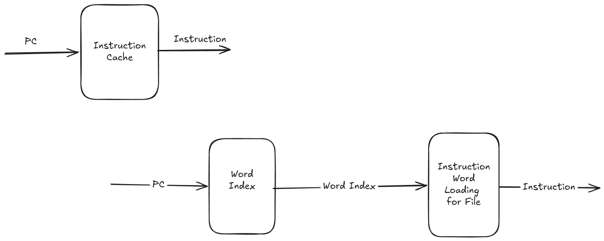

# MiniMIPS

MiniMIPS is a small 32-bit processor written in Verilog. It is a simulation
project for exploring instruction decoding, register operations, memory access,
and the path from assembly code to a running program.

The current RTL uses a simple datapath with separate instruction and data
memories. It has 16 registers (`R0`-`R15`), a custom instruction format, and a
`halt` instruction for ending a program.

## Run It

From the repository root:

```sh
make preset
assember/build/minimips-as sw/asm/smoke.s -o sw/hex/smoke.hex
make run-soc_tb HEX=sw/hex/smoke.hex
```

The smoke test should finish with `PASS`. Its register dump is written to
`build/soc_tb.dump`, and its waveform is written to `waves/soc_tb.vcd`.

To inspect the waveform:

```sh
make wave-soc_tb HEX=sw/hex/smoke.hex
```

The instruction format, memory ranges, and halt encoding are documented in
[`docs/memory_map.md`](docs/memory_map.md). The assembler has its own project
notes in [`assember/README.md`](assember/README.md).

## Checks

Run the RTL compile check with:

```sh
make compile
```

Run the available unit and system tests with:

```sh
make test
```

## Architecture

### Control Path



### Data Path



### ALU



### Register File



### Program Counter



### Next Address Logic



### Instruction Cache


